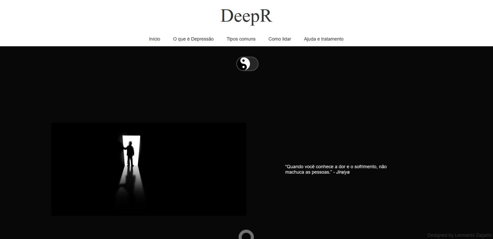
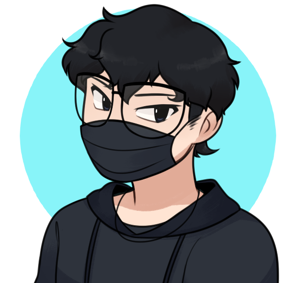

# DeePr




> Site pessoal com foco na dispersão de informações sobre a depressão e suas variantes.

### Ajustes e melhorias

O projeto ainda está em desenvolvimento e as próximas atualizações serão voltadas nas seguintes tarefas:

- [ ] Tarefa 1 - Responsividade
- [ ] Tarefa 2 - Correções de bugs visuais
- [ ] Tarefa 3 - tradução para outras linguas
- [ ] Tarefa 4 - Atualização no conteúdo do site

## 💻 Pré-requisitos

Antes de começar, verifique se você atendeu aos seguintes requisitos:
* Você instalou a versão mais recente do navegador que utiliza.
* Você tem uma máquina `<Windows / Linux / Mac>`. 
* Você possui `<VSCode>`.

## ☕ Usando <DeePr>

Para usar <DeePr>, siga estas etapas:

```
Você poderá alterar a cor do fundo da tela clicando no simbolo circular(YinYang) localizado logo no meio da tela.
```

## 📫 Contribuindo para <DeePr>

Para contribuir com <DeePr>, siga estas etapas:

1. Bifurque este repositório.
2. Crie um branch: `git checkout -b <nome_branch>`.
3. Faça suas alterações e confirme-as: `git commit -m '<mensagem_commit>'`
4. Envie para o branch original: `git push origin <nome_do_projeto> / <local>`
5. Crie a solicitação de pull.

Como alternativa, consulte a documentação do GitHub em [como criar uma solicitação pull](https://help.github.com/en/github/collaborating-with-issues-and-pull-requests/creating-a-pull-request).

## 🤝 Colaboradores

Pessoas que contribuíram para este projeto:

<table>
  <tr>
    <td align="center">
      <a href="#">
        <br>
        <sub>
          <b>Leonardo Zagatto</b>
        </sub>
      </a>
    </td>
  </tr>
</table>


## 😄 Seja um dos contribuidores

Quer fazer parte desse projeto? Clique [AQUI](mailto:leozagatto1@gmail.com) e me envie um email.

[⬆ Voltar ao topo](#nome-do-projeto)<br>
